**PROCESO PARA LA CONSTRUCCIÓN, DESARROLLO E IMPLEMENTACIÓN DE LA APP
MÓVIL**

**Objetivo**

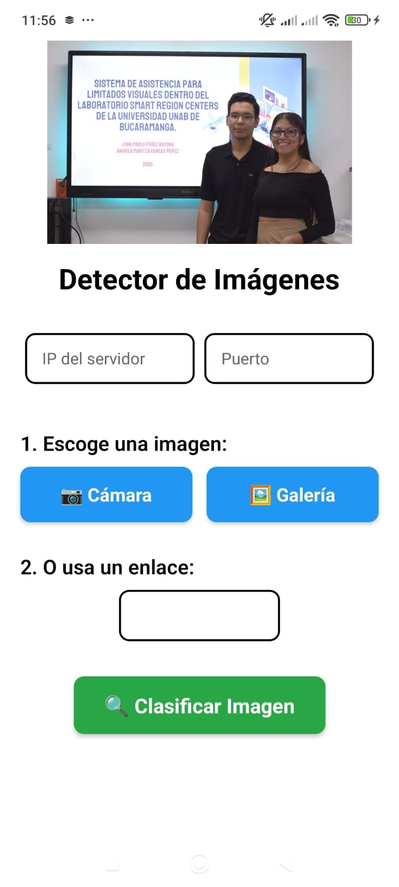{width="4.064583333333333in"
height="7.620138888888889in"}Desarrollar una aplicación móvil para
Android que capture una foto, la envíe a un servidor backend en AWS EC2
mediante una API REST, procese la imagen usando el modelo preentrenado
YOLOv8 para detectar el objeto en la imagen y muestre la predicción en
la aplicación móvil.

**Estructura del Taller**

**Requisitos del Proyecto**

1.  Configuración del Backend en Ubuntu (AWS EC2)

2.  Desarrollo del API con Flask o FastAPI

3.  Desarrollo del Frontend en VsC con React Naive

4.  Pruebas de Integración

**Backend (FastAPI)**

- **AWS EC2** con Ubuntu

- **FastAPI** para el backend

- **Modelo de Regresión Lineal** guardado con **Joblib**

**Frontend (React Native)**

- **Windows 11** para el desarrollo

- **React Native** CLI

- **Axios** para hacer solicitudes HTTP

**1. Backend - FastAPI en AWS EC2**

**1.1 Configurar la Instancia EC2 en AWS**

1.  En la consola de administración de AWS seleccione el servicio de EC2
    (servidor virtual) o escriba en buscar.

> 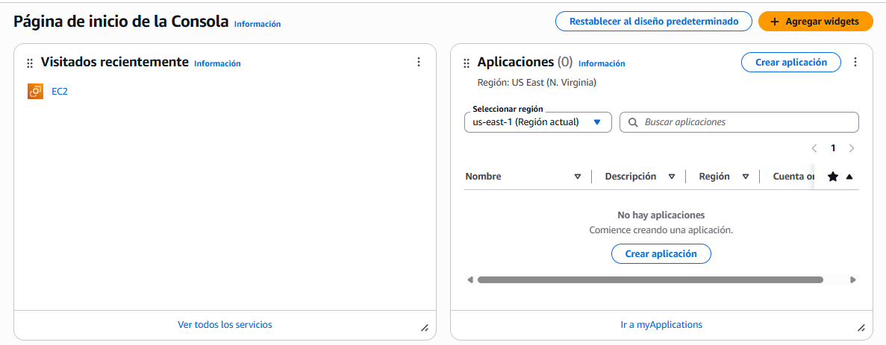{width="6.1375in"
> height="2.39375in"}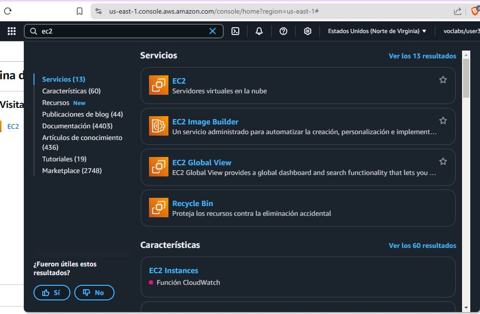{width="6.1375in"
> height="4.007638888888889in"}

2.  Ve a la opción para lanzar la instancia

> 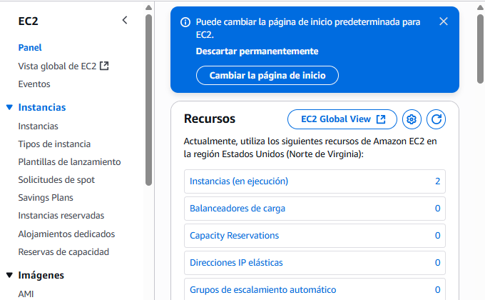{width="6.1375in"
> height="3.790277777777778in"}

3.  Lanza una instancia nueva

{width="6.1375in"
height="1.9402777777777778in"}

4.  Inicia una nueva **instancia EC2** en AWS (elige Ubuntu como sistema
    operativo), puede dejar la imagen por defecto.

{width="6.1375in"
height="3.529861111111111in"}

5.  Para este proyecto dado que el tamaño del modelo a descargar es
    grande necesitamos una maquina con más memoria y disco. con nuesra
    licencia tenemos permiso desde un micro lanzar hasta un T2.Large.

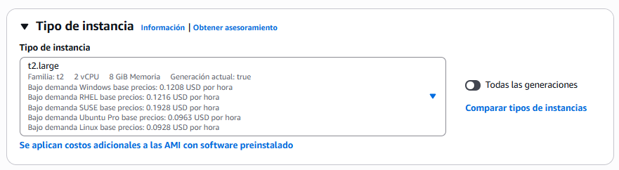{width="6.1375in"
height="1.6861111111111111in"}

6.  seleccione el par de claves ya creado, o cree uno nuevo (Uno de los
    dos, pero recuerde guardar esa llave que la puede necesitar, no la
    pierda)

> Crea el nuevo par de claves
>
> {width="6.1375in"
> height="1.273611111111111in"}
>
> Asigna los datos necesarios
>
> {width="5.719548337707787in"
> height="5.459095581802274in"}

Detector

> {width="6.1375in"
> height="1.2118055555555556in"}

Detector

7.  Habilite los puertos de shh, web y https, para este proyecto no lo
    vamos a usar no es necesario, pero si vas a publicar una web es
    requerido.

> 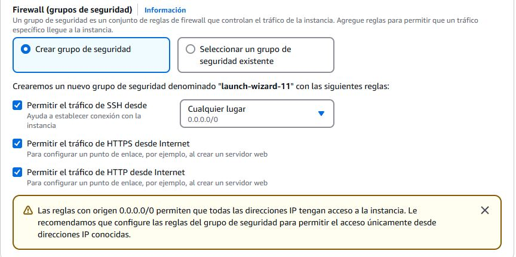{width="6.1375in"
> height="3.0541666666666667in"}

8.  Configure el almacenamiento. Este proyecto como se dijo requere
    capacidad en disco. Aumente el disco a 16 GiB.

> 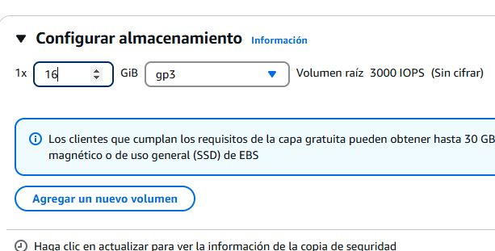{width="6.1375in"
> height="3.1194444444444445in"}

9.  Finalmente lance la instancia (no debe presentar error, si tiene
    error debe iniciar de nuevo). Si todo sale bien, por favor haga
    click en instancias en la parte superior.

> 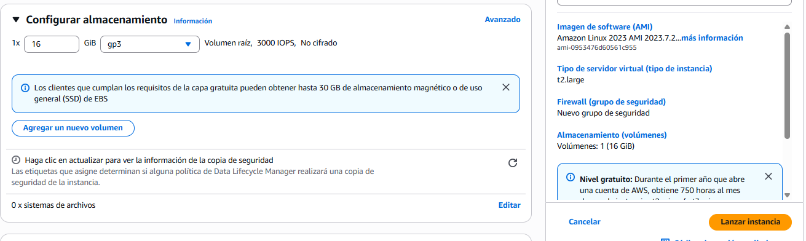{width="6.1375in"
> height="1.8347222222222221in"}

10. Dado que normalmente en la lista de instancias NO VE la nueva
    instancia lanzada por favor actualice la página Web o en ir a
    instancias

> 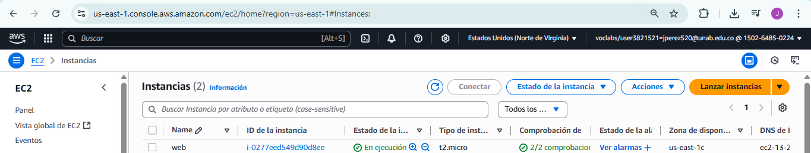{width="6.1375in"
> height="1.1645833333333333in"}
>
> 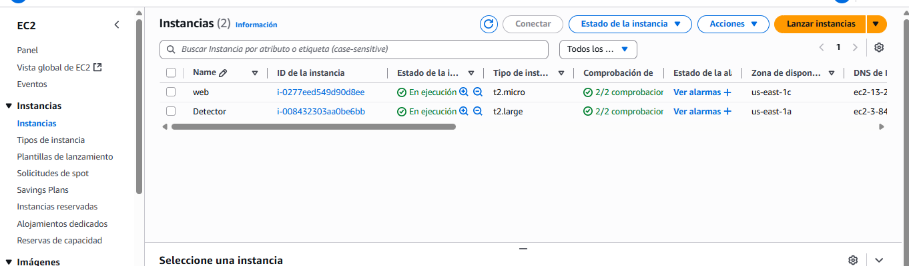{width="6.1375in"
> height="1.8020833333333333in"}

11. Vamos a seleccionar el servidor ec2 lanzado.

> {width="6.1375in"
> height="1.8020833333333333in"}

12. Verificar la dirección IP pública y el DNS en el resumen de la
    instancia

{width="6.1375in"
height="2.432638888888889in"}

13. {width="6.1375in"
    height="0.25416666666666665in"}Debido a que vamos a lanzar un API
    rest debemos habilitar el puerto. Vamos al seguridad

14. Vamos al grupo de seguridad

> {width="6.1375in"
> height="1.3659722222222221in"}

15\. Vamos a ir a Editar la regla de entrada

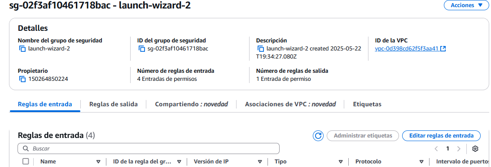{width="6.1375in"
height="2.097916666666667in"}

16\. Ahora vamos a agregar un regla de entrada para habilitar el puerto,
recuerden poner IPV 4

{width="2.3854166666666665in"
height="0.6416666666666667in"}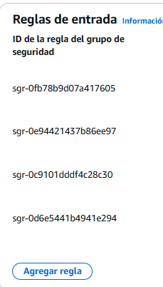{width="2.385749125109361in"
height="2.7536297025371828in"}

17\. Abre un puerto en el grupo de seguridad (por ejemplo,
puerto **8080**) para permitir acceso a la API.

{width="6.1375in"
height="0.9909722222222223in"}

18\. Guardemos la regla de entrada.

{width="6.1375in"
height="0.9909722222222223in"}

19\. Ve nuevamente a instancias

{width="6.1375in"
height="1.3145833333333334in"}

20\. Vamos a conectar con la consola del servidor

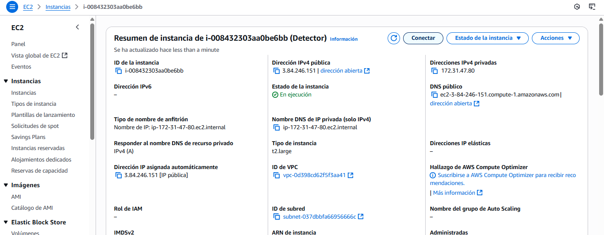{width="6.1375in" height="2.3875in"}

21\. Si no puedes conectarse directamente a la instancia EC2, conectate
con SSH, es decir en la consola de administración de instancia creada
hay una opcion de \"Conectar\", has clic y luego conectar otra vez. Si
no puede conectarse puede hacerlo con el SSH:

ssh -i \"tu_clave.pem\" ubuntu@\<tu_ip_ec2\>

**1.2 Instalar Dependencias en el Servidor EC2**

Una vez dentro de tu instancia EC2, instalar las librerias y
complementos como FastAPI y las dependencias necesarias para ello debes
crear una carpeta en donde realizaras las instalaciones:

**Ver las carpetas**

ls -la

**Ver la version de python**

python3 -V

**Si se requiere, puede actualizar los paquetes**

sudo apt update

{width="6.1375in"
height="1.8888888888888888in"}

**Si se requiere: Instalar pip y virtualenv**

sudo apt install python3-pip python3-venv

**Crear la carpeta del proyecto**

mkdir proyecto

**Accede a tu carpeta**

cd proyecto

**Crear y activar un entorno virtual**

python3 -m venv venv

source venv/bin/activate

Recuerda que en el prompt debe obersar que el env debe quedar activo

**Sube tu modelo a trabajar**

**✅ Opción 1: Descargar directamente desde GitHub (si el enlace es
directo al archivo)**

Si tienes el enlace directo al archivo (por ejemplo:
https://github.com/usuario/repositorio/raw/rama/path/best.pt):

Copiar:

wget https://github.com/tu-usuario/repositorio/raw/rama/path/best.pt

O con curl:

Copiar:

curl -L -o best.pt
https://github.com/usuario/repositorio/raw/rama/path/best.pt

Esto descargará best.pt en el directorio actual (\~/proyecto/).

**🔐 Opción 2: Clonar el repositorio (si no tienes enlace directo o
necesitas autenticación)**

1.  Clona el repositorio completo (si el archivo está en un repositorio
    privado, deberás usar SSH o token personal):

Copiar:

git clone https://github.com/usuario/repositorio.git

2.  Luego, mueve el archivo best.pt a tu carpeta actual si lo deseas:

Copiar:

mv repositorio/ruta/al/archivo/best.pt .

3.  (Opcional) Borra el repositorio si ya no lo necesitas:

Copiar:

rm -rf repositorio

**Instalar FastAPI, Uvicorn, Joblib, TensorFlow, Python-Multipart,
Pillow, Ultralytics**

pip install fastapi uvicorn keras

pip install tensorflow

pip install python-multipart

pip install pillow

pip install \--no-cache-dir ultralytics

pip uninstall -y opencv-python opencv-python-headless matplotlib
tensorboard

**1.3 Crear la API FastAPI**

Crea un archivo app.py en tu instancia EC2 para definir la API que
servirá las predicciones.

nano app.py

{width="6.1375in"
height="1.9840277777777777in"}

Desarrollo del Backend API Usaremos FastAPI por su rendimiento y
facilidad de uso. El backend aceptará una imagen, la procesará con el
modelo YOLO "best.pt" y devolverá la predicción. Puede copiar este
código en tu editor de nano:

from fastapi import FastAPI, File, UploadFile

from fastapi.responses import JSONResponse

from ultralytics import YOLO

import numpy as np

from PIL import Image

import io

import uvicorn

import cv2

import base64

app = FastAPI()

model = YOLO(\"/home/ubuntu/proyecto/best.pt\")

classes = {

0: \'advanced_optical_microscope\',

1: \'agitador_magnetico_placa_calentamiento_EQ_AMPC1C\',

2: \'aire_acondicionado_YORK\',

3: \'cafetera\',

4: \'computador\',

5: \'control_remoto_robot\',

6: \'control_remoto_smart_tv\',

7: \'estacion_soldadura_aire_caliente\',

8: \'impresora_3d_creality_k1_max\',

9: \'mini_fresadora_cnc\',

10: \'mouse\',

11: \'objects\',

12: \'osciloscopio_digital\_ rigol_ds1202ze\',

13: \'puerta\',

14: \'robot_humanoide_AULER\',

15: \'robot_lego_mindstorms_ev3\',

16: \'router\',

17: \'soil_integrated_sensor\',

18: \'tablet\',

19: \'tomacorrientes_110V\',

20: \'ups_netio\'

}

def draw_boxes(image: np.ndarray, preds) -\> np.ndarray:

boxes = preds.boxes.xyxy.cpu().numpy()

scores = preds.boxes.conf.cpu().numpy()

class_ids = preds.boxes.cls.cpu().numpy().astype(int)

for box, score, cls_id in zip(boxes, scores, class_ids):

x1, y1, x2, y2 = map(int, box)

label = f\"{classes.get(cls_id, \'unknown\')} {score:.2f}\"

color = (0, 255, 0)

cv2.rectangle(image, (x1, y1), (x2, y2), color, 2)

cv2.putText(image, label, (x1, y1 - 10),

cv2.FONT_HERSHEY_SIMPLEX, 0.5, color, 2)

return image

def encode_image_to_base64(image: np.ndarray) -\> str:

\_, buffer = cv2.imencode(\".jpg\", image)

base64_str = base64.b64encode(buffer).decode()

return f\"data:image/jpeg;base64,{base64_str}\"

\@app.post(\"/predict/\")

async def predict(file: UploadFile = File(\...)):

try:

image_bytes = await file.read()

pil_image = Image.open(io.BytesIO(image_bytes)).convert(\"RGB\")

image_np = np.array(pil_image)

results = model(pil_image)

preds = results\[0\]

\# Extrae detecciones

boxes = preds.boxes.xyxy.cpu().numpy()

scores = preds.boxes.conf.cpu().numpy()

class_ids = preds.boxes.cls.cpu().numpy().astype(int)

detections = \[\]

for i in range(len(class_ids)):

detections.append({

\"class_id\": int(class_ids\[i\]),

\"class_name\": classes.get(int(class_ids\[i\]), \"unknown\"),

\"confidence\": float(scores\[i\]),

})

\# Dibuja y codifica la imagen con bounding boxes

annotated_img = draw_boxes(image_np.copy(), preds)

base64_image = encode_image_to_base64(annotated_img)

return JSONResponse(content={

\"predictions\": detections,

\"image\": base64_image

})

except Exception as e:

return JSONResponse(content={\"error\": str(e)}, status_code=500)

if \_\_name\_\_ == \"\_\_main\_\_\":

uvicorn.run(app, host=\"0.0.0.0\", port=8080)

(venv) ubuntu@ip-172-31-47-80:\~/proyecto\$

Para salir del editor **nano** oprime CTRL-X y luego (Save modified
buffer? ) escribe \"Y\" y (Save modified buffer? app.py) ENTER. puede
verificar que archivo fue creado

ls -la

o puedes ver si en el archivo quedó el codigo guardado

cat app.py

**1.5 Ejecutar el Servidor FastAPI**

Para ejecutar el servidor de FastAPI, usa Uvicorn:

source venv/bin/activate

python app.py

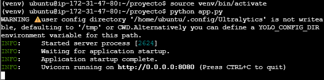{width="6.1375in"
height="1.5152777777777777in"}

**1.6 Error en el Servidor**

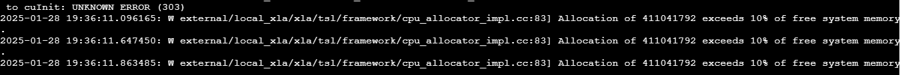{width="6.1375in"
height="0.5198447069116361in"}

Si al momento de ejecutar el servidor te da un error como en el de la
anterior imagen en el cual se excede la memoria del sistema utiliza el
siguiente comando y vuelve a intentarlo

sudo sync; sudo sysctl -w vm.drop_caches=3

**PUEBA DEL BACKEND:**

Sube una imagen:

- cd \~/proyecto

- wget
  \'mouse-hp-bluetooth-negro-195908483182.jpg?v=637869384092700000\'
  mouse_hp.jpg

Cámbiale el nombre a algo simple, por ejemplo:

- mv \'mouse-hp-bluetooth-negro-195908483182.jpg?v=637869384092700000\'
  mouse_hp.jpg

Con el modelo ya subido, realiza la validación del modelo desde el mismo
Ec2 de AWS:

curl -X POST \"http://localhost:8080/predict/\" -F
\"file=@mouse_hp.jpg\"

Tambien algunos expertos proponen este mecanismo de Prueba . Tomado de :
<https://github.com/adiacla/FullStack-RNN?tab=readme-ov-file>

Si vas a utilizar postman entra en el siguiente
enlance [[https://www.postman.com]{.underline}](https://www.postman.com/) ,
crea o ingresa a tu cuenta y sigue los siguientes pasos:

1.  Dale click en new request

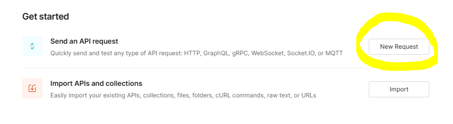{width="6.1046511373578305in"
height="1.6757327209098862in"}

2.  Poner las siguientes opciones en la request

{width="6.128133202099738in"
height="2.583222878390201in"}

Recuerda que debes poner la URL de tu EC2 acompañado con el :8080 que es
el puerto y con el /predict que es el endpoint que queremos probar.

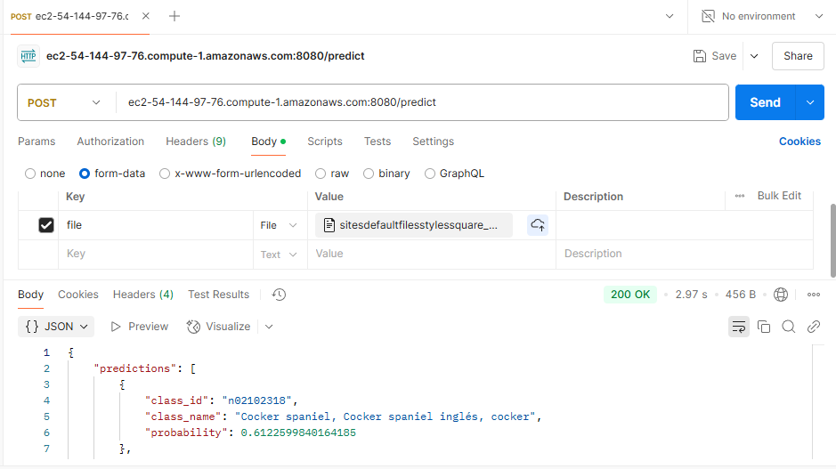{width="6.290795056867892in"
height="3.530475721784777in"}

La API estará disponible en http://\<tu_ip_ec2\>:8080.

**2. Frontend en React Native: React Native en Windows 11**

Node.js y npm:

**Paso 1: Verifica la instalación de Node.js y npm ejecutando en la
terminal:**

node -v

npm -v

Si no ves la versión de Node.js (al menos v18.x.x) o npm (v10.x.x),
descarga e instala la versión LTS de Node.js desde aquí.

[[https://reactnative.dev/docs/set-up-your-environment]{.underline}](https://reactnative.dev/docs/set-up-your-environment)

Va a requerir primero bajar

[[https://chocolatey.org/install]{.underline}](https://chocolatey.org/install)

Todos los pasos los puede verificar aqui

[[https://youtu.be/nwXUXt_QqU8?si=dWjeavfLB06cz-bo]{.underline}](https://youtu.be/nwXUXt_QqU8?si=dWjeavfLB06cz-bo)

Verifica la instalación de Android Studio. Abre Android Studio y
asegúrate de que el Android SDK y el Android Virtual Device (AVD) estén
correctamente instalados, en el siguiente link puedes realizar la
descarga.

[[https://developer.android.com/studio?hl=es-419&\_gl=1\*5t55h4\*\_up\*MQ..&gclid=EAIaIQobChMIie2A3uCYiwMVJ7VaBR2njTbJEAAYASAAEgIdWvD_BwE&gclsrc=aw.ds]{.underline}](https://developer.android.com/studio?hl=es-419&_gl=1*5t55h4*_up*MQ..&gclid=EAIaIQobChMIie2A3uCYiwMVJ7VaBR2njTbJEAAYASAAEgIdWvD_BwE&gclsrc=aw.ds)

Dentro de Android Studio, ve a SDK Manager y asegúrate de que estén
instaladas las siguientes herramientas:

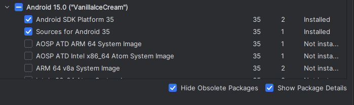{width="6.127777777777778in"
height="1.820138888888889in"}Android SDK Platform 35.

Intel x86 Atom System Image o Google APIs Intel x86 Atom System Image.
(depende el procesador de tu maquina)

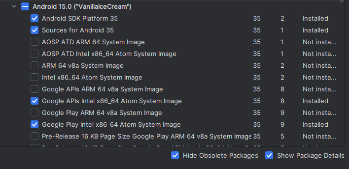{width="6.151291557305337in"
height="2.988150699912511in"}

Android SDK Build Tools 35.0.0.

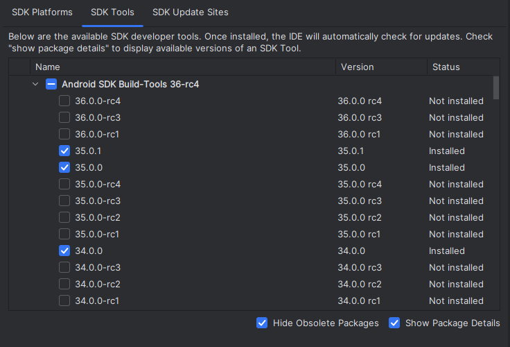{width="6.134027777777778in"
height="4.170138888888889in"}

Si no tienes el AVD (Android Virtual Device), crea uno. Si tienes un
dispositivo físico Android, puedes usarlo directamente conectándolo al
PC a través de USB y habilitando la depuración USB en tu dispositivo.

Si no tienes el command-line tools, entra a la pagina de Android
Studio [[https://developer.android.com/studio?gad_source=1&gclid=EAIaIQobChMIie2A3uCYiwMVJ7VaBR2njTbJEAAYASAAEgIdWvD_BwE&gclsrc=aw.ds&hl=es-419]{.underline}](https://developer.android.com/studio?gad_source=1&gclid=EAIaIQobChMIie2A3uCYiwMVJ7VaBR2njTbJEAAYASAAEgIdWvD_BwE&gclsrc=aw.ds&hl=es-419)

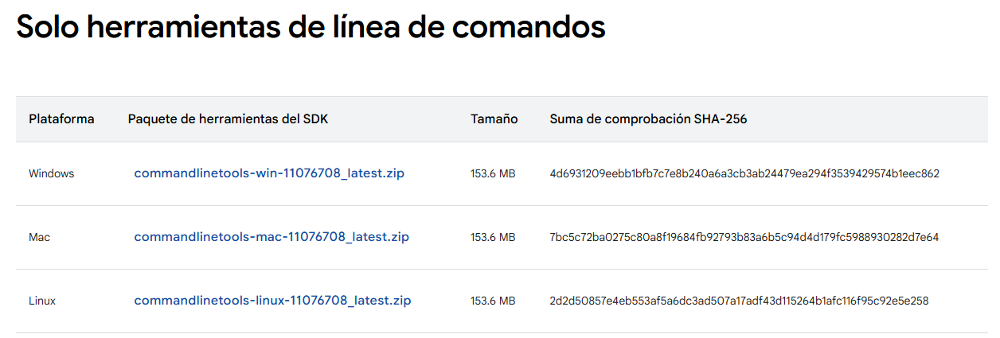{width="6.1625in"
height="2.087209098862642in"}

Una vez tienes el command-line tools debes extraerlo en el Android/SDK
C:\\Users\\Smartcenter\\AppData\\Local\\Android\\Sdk

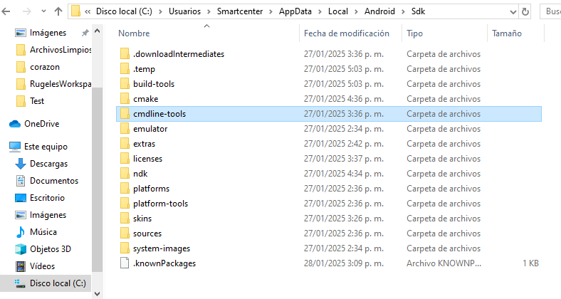{width="6.074699256342957in"
height="3.2354549431321087in"}

**Verficiación del NDK**

- Abre Android Studio

Ve a: More Actions \> SDK Manager

Haz clic en la pestaña SDK Tools

Marca la opción NDK (Side by side)

Si ya está marcada:

Desmárcala

Aplica cambios (esto desinstala)

- Luego vuelve a marcarla y aplica de nuevo (esto reinstala
  correctamente)

Asegúrate también de tener marcado:

CMake

Android SDK Command-line Tools (latest)

Reinicia Android Studio y tu terminal (cmd o Node.js Prompt)

**Variables de Entorno de Usuario:**

Verifica que las variables de entorno estén correctamente configuradas,
para ello accede a las variables de entorno desde el buscador de
windows:

Una vez estes ahi, dale click en variables de entorno

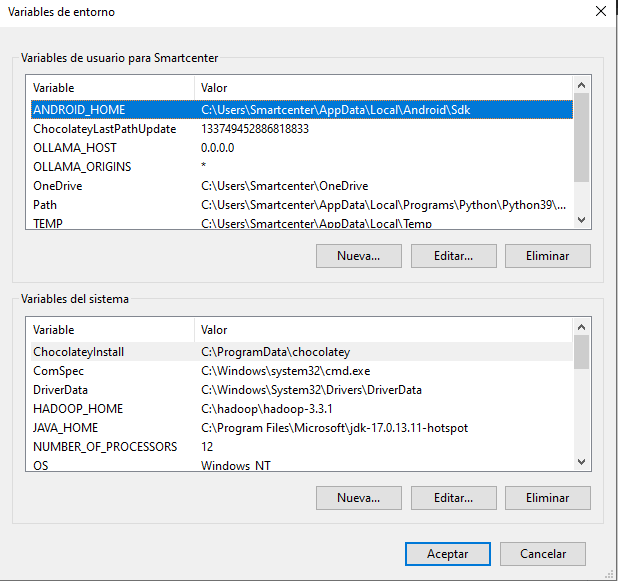{width="6.0947922134733155in"
height="5.720930664916885in"}

ANDROID_HOME debe apuntar a la carpeta de instalación del SDK de
Android, el path de su cuenta o del sistema configure: Por ejemplo:

%LOCALAPPDATA%\\Android\\Sdk

%ANDROID_HOME%\\tools\\bin

%ANDROID_HOME%\\emulator

%ANDROID_HOME%\\platform-tools

%ANDROID_HOME%\\tools

{width="6.14375in"
height="5.767361111111111in"}

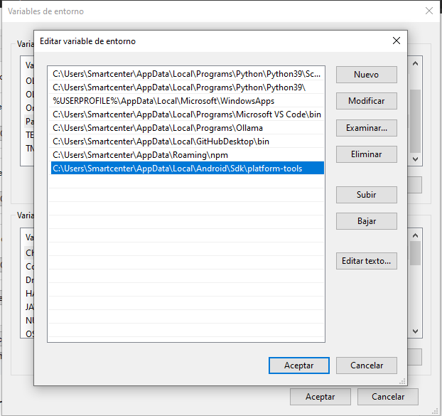{width="6.14375in"
height="5.391680883639545in"}

##Asegúrate de que el emulador esté iniciado ANTES de correr run-android

Revisa que el dispositivo tenga una imagen compatible (por ejemplo, API
30 o superior)

Usa el emulador Pixel API 33 x86_64 (recomendado)

**Paso 2: Limpiar posibles residuos de instalaciones previas**

Si has tenido problemas con instalaciones previas, es recomendable
limpiar completamente las dependencias globales de npm y React Native.

Eliminar React Native CLI globalmente: Si tienes instalado
react-native-cli globalmente, elimínalo:

npm uninstall -g react-native-cli

Eliminar la caché de npm: Borra la caché de npm para evitar problemas
con dependencias:

npm cache clean \--force

**Paso 3: Crear el Proyecto de React Native**

Una vez que todo esté instalado y configurado correctamente, crea un
nuevo proyecto de React Native con el siguiente comando:

Ejecutar directamente en Node.js Command Prompt en Administrador, si
prefieres no modificar las políticas de PowerShell, puedes usar el
terminal proporcionado por Node.js:

Abre Node.js Command Prompt (generalmente instalado junto con Node.js).
Ejecuta tu comando:

npx \@react-native-community/cli init imagenes

(imagenes es el nombre del proyecto)

Conectar tu dispositivo físico: En adroide puedes configurar un
dispositivo virtual

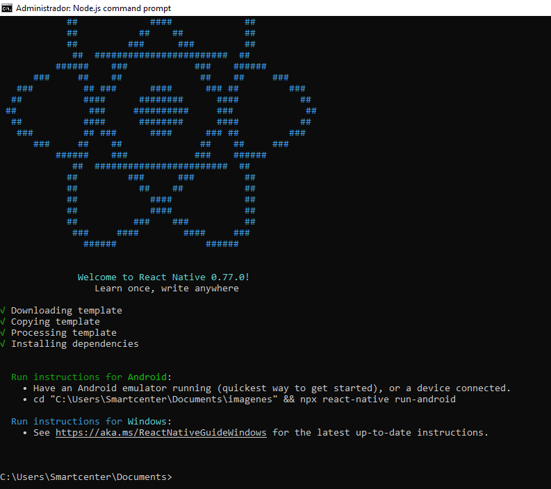{width="6.156944444444444in"
height="5.48125in"}En fisico:

Habilita Depuración por USB en tu dispositivo: Ve a Configuración \>
Acerca del teléfono. Toca varias veces en \"Número de compilación\" para
habilitar el modo desarrollador. Ve a Opciones de desarrollador y activa
Depuración USB. Conecta tu dispositivo a tu computadora con un cable
USB.

Esto debería listar tu dispositivo.

Si no te llega a funcionar de este metodo, busca en google el modelo de
tu celular y como activar el modo desarrollador

Accede a la carpeta de tu proyecto:

cd imagenes

Luego realiza una limpieza del cache:

npm cache clean \--force

Ahora ejecuta el siguiente comando y veras la plantilla base de React
Native

npx react-native run-android

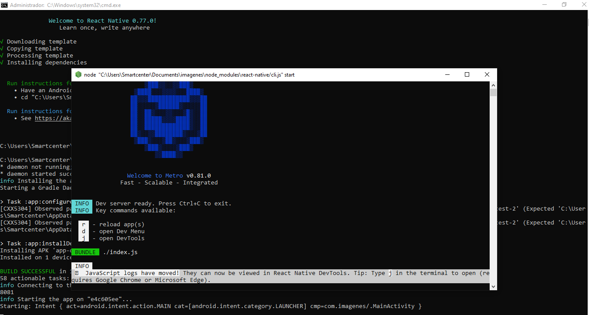{width="5.9759864391951005in"
height="3.202694663167104in"}

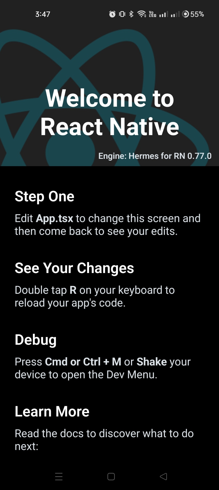{width="3.816738845144357in"
height="8.520786307961504in"}

**Paso 4: Instalar dependencias necesarias:**

Después de agregar el archivo App.js, asegúrate de que las dependencias
que usas, como axios para HTTP y expo-image-picker, estén instaladas.
Instalaciones Requeridas: Asegúrate de haber instalado las dependencias
necesarias:

npm install axios

npm install \--save expo-image-picker

npm install react-native-permissions

npm install react-native-image-picker

npm install react-native-tts

**Paso 5: Crea el archivo app.tsx**

Cambia el archivo app.tsx y ejecuta estos comandos en el Visual Studio
Code dentro del directorio de tu proyecto:

import React, { useState, useEffect } from \'react\';

import {

  View, Text, TextInput, TouchableOpacity, StyleSheet,

  Alert, ScrollView, Image, Platform, PermissionsAndroid,

  Dimensions, Animated, PanResponder, Vibration,

  AccessibilityInfo

} from \'react-native\';

import axios from \'axios\';

import { launchCamera, launchImageLibrary } from
\'react-native-image-picker\';

import Tts from \'react-native-tts\';

import descripciones from \'./proma\';

const SCREEN_HEIGHT = Dimensions.get(\'window\').height;

const SCREEN_WIDTH = Dimensions.get(\'window\').width;

const isValidImageUrl = (url) =\> {

  if (!url) return false;

  try {

    const parsed = new URL(url);

    const pathname = parsed.pathname.toLowerCase().split(\'?\')\[0\];

    const extList = \[\'jpg\', \'jpeg\', \'png\', \'gif\', \'webp\',
\'bmp\', \'svg\'\];

    return extList.some(ext =\> pathname.endsWith(\`.\${ext}\`));

  } catch {

    return false;

  }

};

const SplashScreen = ({ onSwipeComplete }) =\> {

  const pan = new Animated.ValueXY();

  const panResponder = PanResponder.create({

    onStartShouldSetPanResponder: () =\> true,

    onPanResponderMove: Animated.event(\[null, { dy: pan.y }\], {
useNativeDriver: false }),

    onPanResponderRelease: (\_, gestureState) =\> {

      if (gestureState.dy \< -50) {

        Animated.timing(pan.y, {

          toValue: -SCREEN_HEIGHT,

          duration: 300,

          useNativeDriver: true

        }).start(onSwipeComplete);

        Vibration.vibrate(100);

        Tts.speak(\'Iniciando aplicación\');

      } else {

        Animated.spring(pan.y, {

          toValue: 0,

          useNativeDriver: true

        }).start();

      }

    }

  });

  return (

  \<Animated.View

    style={\[styles.splashContainer, { transform: \[{ translateY: pan.y
}\] }\]}

    {\...panResponder.panHandlers}

    accessibilityLabel=\"Pantalla de inicio\"

    accessibilityHint=\"Puedes deslizar hacia arriba para continuar\"

  \>

    \<Image

      source={require(\'./assets/portada.jpg\')}

      style={styles.splashImage}

      resizeMode=\"cover\"

      accessibilityLabel=\"Imagen de portada de la aplicación\"

    /\>

    \<View style={styles.overlay}\>

      \<Text

        style={styles.splashText1}

        accessibilityRole=\"text\"

        accessibilityLabel=\"Texto principal de la pantalla de inicio\"

      \>

        DETECTOR

      \</Text\>

    \</View\>

  \</Animated.View\>

);

};

const MainApp = ({ ip, setIp, puerto, setPuerto, \...props }) =\> {

  return (

    \<ScrollView

      contentContainerStyle={styles.container}

      accessibilityLabel=\"Detector de Imágenes\"

      accessibilityHint=\"Aplicación para clasificar imágenes con
soporte para lectores de pantalla\"\>

     

      \<View style={styles.header}\>

        \<Image

          source={require(\'./assets/logo.png\')}

          style={styles.logo}

          accessibilityLabel=\"Logo de la aplicación\"

        /\>

        \<Text style={styles.title} accessibilityRole=\"header\"\>

          Detector de Imágenes

        \</Text\>

      \</View\>

      \<View style={styles.inputContainer}\>

        \<TextInput

          style={styles.input}

          placeholder=\"IP del servidor\"

          value={ip}

          onChangeText={setIp}

          placeholderTextColor=\"#666666\"

          accessibilityLabel=\"Campo para IP del servidor\"

          accessibilityHint=\"Ingresa la dirección IP del servidor\"

        /\>

        \<TextInput

          style={styles.input}

          placeholder=\"Puerto\"

          value={puerto}

          onChangeText={setPuerto}

          placeholderTextColor=\"#666666\"

          keyboardType=\"numeric\"

          accessibilityLabel=\"Campo para puerto del servidor\"

          accessibilityHint=\"Ingresa el número de puerto del servidor\"

        /\>

      \</View\>

      {/\* Resto de los componentes existentes \*/}

      {props.children}

    \</ScrollView\>

  );

};

const App = () =\> {

  const \[showSplash, setShowSplash\] = useState(true);

  const \[ip, setIp\] = useState(\'\');

  const \[puerto, setPuerto\] = useState(\'\');

  const \[imagenUri, setImagenUri\] = useState(null);

  const \[imagenUrl, setImagenUrl\] = useState(\'\');

  const \[respuesta, setRespuesta\] = useState(null);

  const \[imagenProcesada, setImagenProcesada\] = useState(null);

  const \[cargando, setCargando\] = useState(false);

  useEffect(() =\> {

    const inicializarApp = async () =\> {

      try {

        if (Platform.OS === \'android\') {

          await PermissionsAndroid.requestMultiple(\[

            PermissionsAndroid.PERMISSIONS.CAMERA,

            PermissionsAndroid.PERMISSIONS.READ_EXTERNAL_STORAGE

          \]);

        }

        await Tts.setDefaultLanguage(\'es-ES\');

        await Tts.setDefaultRate(0.5);

        Tts.speak(\'Bienvenido al Detector de Imágenes - Desliza Hacia
Arriba para Comenzar\');

      } catch (error) {

        console.error(\'Error al inicializar:\', error);

        Alert.alert(\'Error\', \'No se pudieron inicializar algunos
componentes de la aplicación\');

      }

    };

    inicializarApp();

  }, \[\]);

  const speakResponse = (predictions) =\> {

    if (!predictions?.length) return;

   

    const speechText = predictions.map(item =\> {

      const cleanClassName = item.class_name.replace(/\[\_\*/#\"\]/g,
\'\');

      const descripcion = descripciones\[item.class_name\] \|\|
cleanClassName;

      return \`La imagen se clasifica como: \${cleanClassName} con una
probabilidad de \${(item.confidence \* 100).toFixed(2)}%.
\${descripcion}.\`;

    }).join(\' \');

    Tts.speak(speechText);

    Vibration.vibrate(\[0, 200, 100, 200\]);

  };

  const handleImageResponse = (response) =\> {

    if (response?.assets?.\[0\]?.uri) {

      setImagenUri(response.assets\[0\].uri);

      setImagenUrl(\'\');

      setRespuesta(null);

      setImagenProcesada(null);

      Tts.speak(\'Imagen seleccionada correctamente\');

      Vibration.vibrate(100);

    }

  };

  const tomarFoto = async () =\> {

    try {

      Tts.speak(\'Abriendo cámara\')

      Tts.speak(\'Toma una Foto\');

      const result = await launchCamera({

        mediaType: \'photo\',

        quality: 0.7,

        includeBase64: true

      });

      handleImageResponse(result);

    } catch (error) {

      Alert.alert(\'Error\', \'No se pudo acceder a la cámara\');

      Tts.speak(\'Error al acceder a la cámara\');

    }

  };

  const seleccionarImagen = async () =\> {

    try {

      Tts.speak(\'Abriendo galería\')

      Tts.speak(\'Escoge una Imagen\');

      const result = await launchImageLibrary({

        mediaType: \'photo\',

        quality: 0.7,

        includeBase64: true

      });

      handleImageResponse(result);

    } catch (error) {

      Alert.alert(\'Error\', \'No se pudo acceder a la galería\');

      Tts.speak(\'Error al acceder a la galería\');

    }

  };

  const enviarImagen = async () =\> {

    if (!ip \|\| !puerto) {

      const mensaje = \'Por favor, ingresa la IP y el puerto del
servidor.\';

      Alert.alert(\'Error\', mensaje);

      Tts.speak(mensaje);

      return;

    }

    if (!imagenUri && !isValidImageUrl(imagenUrl)) {

      const mensaje = \'Por favor, selecciona una imagen o proporciona
una URL válida.\';

      Alert.alert(\'Error\', mensaje);

      Tts.speak(mensaje);

      return;

    }

    try {

      setCargando(true);

      Tts.speak(\'Procesando imagen, por favor espera\');

      Vibration.vibrate(\[0, 200, 200, 200\]);

      const formData = new FormData();

      let response;

      if (imagenUri) {

        formData.append(\'file\', {

          uri: imagenUri,

          type: \'image/jpeg\',

          name: \'imagen.jpg\',

        });

        response = await
axios.post(\`http://\${ip}:\${puerto}/predict/\`, formData, {

          headers: { \'Content-Type\': \'multipart/form-data\' },

          timeout: 30000

        });

      } else {

        response = await
axios.post(\`http://\${ip}:\${puerto}/predict_url/\`, {

          url: imagenUrl

        }, { timeout: 30000 });

      }

      setRespuesta(response.data.predictions);

      setImagenProcesada(response.data.image);

      speakResponse(response.data.predictions);

    } catch (error) {

      const errorMessage = \`Error: \${error.response?.data?.detail \|\|
error.message}\`;

      Alert.alert(\'Error\', errorMessage);

      Tts.speak(\'Error al procesar la imagen\');

    } finally {

      setCargando(false);

    }

  };

  if (showSplash) {

    return \<SplashScreen onSwipeComplete={() =\> setShowSplash(false)}
/\>;

  }

  return (

    \<MainApp

      ip={ip}

      setIp={setIp}

      puerto={puerto}

      setPuerto={setPuerto}\>

      \<View style={styles.mainContent}\>

        \<Text style={styles.subtitle} accessibilityRole=\"header\"\>

          1. Escoge una imagen:

        \</Text\>

        \<View style={styles.buttonRow}\>

          \<TouchableOpacity

            style={styles.button}

            onPress={tomarFoto}

            disabled={cargando}

            accessibilityLabel=\"Botón para tomar foto\"

            accessibilityHint=\"Activa la cámara para tomar una foto\"\>

            \<Text style={styles.buttonText}\>📷 Cámara\</Text\>

          \</TouchableOpacity\>

          \<TouchableOpacity

            style={styles.button}

            onPress={seleccionarImagen}

            disabled={cargando}

            accessibilityLabel=\"Botón para seleccionar imagen\"

            accessibilityHint=\"Abre la galería para seleccionar una
imagen\"\>

            \<Text style={styles.buttonText}\>🖼️ Galería\</Text\>

          \</TouchableOpacity\>

        \</View\>

        \<Text style={styles.subtitle} accessibilityRole=\"header\"\>

          2. O usa un enlace:

        \</Text\>

        \<TextInput

          style={styles.input}

          placeholder=\"URL de la imagen\"

          value={imagenUrl}

          onChangeText={(text) =\> {

            setImagenUrl(text);

            if (text) setImagenUri(null);

            setRespuesta(null);

            setImagenProcesada(null);

          }}

          editable={!cargando}

          autoCapitalize=\"none\"

          autoCorrect={false}

          accessibilityLabel=\"Campo para URL de imagen\"

          accessibilityHint=\"Ingresa la dirección web de una imagen\"

        /\>

        {imagenUri && (

          \<View style={styles.imageContainer}\>

            \<Text style={styles.imageLabel}\>Imagen Original\</Text\>

            \<Image

              source={{ uri: imagenUri }}

              style={styles.preview}

              accessibilityLabel=\"Vista previa de la imagen
seleccionada\"

            /\>

          \</View\>

        )}

        {!imagenUri && isValidImageUrl(imagenUrl) && (

          \<View style={styles.imageContainer}\>

            \<Text style={styles.imageLabel}\>Imagen desde URL\</Text\>

            \<Image

              source={{ uri: imagenUrl }}

              style={styles.preview}

              accessibilityLabel=\"Vista previa de la imagen desde URL\"

            /\>

          \</View\>

        )}

        {imagenProcesada && (

          \<View style={styles.imageContainer}\>

            \<Text style={styles.imageLabel}\>Imagen Procesada\</Text\>

            \<Image

              source={{ uri: imagenProcesada }}

              style={styles.preview}

              accessibilityLabel=\"Imagen con detecciones\"

            /\>

          \</View\>

        )}

        \<TouchableOpacity

          style={\[styles.analyzeButton, cargando &&
styles.buttonDisabled\]}

          onPress={enviarImagen}

          disabled={cargando}

          accessibilityLabel=\"Botón para clasificar imagen\"

          accessibilityHint=\"Analiza la imagen seleccionada\"\>

          \<Text style={styles.analyzeText}\>

            {cargando ? \'⏳ Procesando\...\' : \'🔍 Clasificar
Imagen\'}

          \</Text\>

        \</TouchableOpacity\>

        {respuesta && (

          \<View style={styles.resultsContainer}\>

            \<Text style={styles.resultsTitle}
accessibilityRole=\"header\"\>

              Resultados:

            \</Text\>

            {respuesta.map((item, idx) =\> {

              const cleanClassName =
item.class_name.replace(/\[\_\*/#\"\]/g, \'\');

              const descripcion = descripciones\[item.class_name\] \|\|
cleanClassName;

              return (

                \<View

                  key={idx}

                  style={styles.resultItem}

                  accessibilityLabel={\`Resultado \${idx + 1}\`}\>

                  \<Text style={styles.resultText}\>

                    • {cleanClassName}: {(item.confidence \*
100).toFixed(2)}%

                  \</Text\>

                  \<Text style={styles.resultDescription}\>

                    {descripcion}

                  \</Text\>

                \</View\>

              );

            })}

          \</View\>

        )}

      \</View\>

    \</MainApp\>

  );

};

const styles = StyleSheet.create({

  splashContainer: {

    flex: 1,

    alignItems: \'center\',

    justifyContent: \'flex-end\',

    backgroundColor: \'#000\', // opcional: por si la imagen no cubre
bien

  },

  splashImage: {

    position: \'absolute\',

    width: \'100%\',

    height: \'100%\',

  },

  splashText: {

    color: \'#fff\',

    fontSize: 18,

    marginBottom: 80,

    textAlign: \'center\',

    paddingHorizontal: 20,

  },

  swipeIndicator: {

    width: 60,

    height: 5,

    borderRadius: 3,

    backgroundColor: \'#fff\',

    marginBottom: 40,

  },

  container: {

    padding: 20,

    backgroundColor: \'#FFFFFF\',

    alignItems: \'center\',

    minHeight: SCREEN_HEIGHT

  },

  header: {

    width: \'100%\',

    alignItems: \'center\',

    marginBottom: 20

  },

  logo: {

    width: 300,

    height: 200,

    marginTop: 20

  },

  splashContainer: {

  flex: 1,

  position: \'relative\',

},

splashImage: {

  width: \'100%\',

  height: \'100%\',

},

overlay: {

  position: \'absolute\',

  top: 0,

  bottom: 0,

  left: 0,

  right: 0,

  justifyContent: \'center\',

  alignItems: \'center\',

  paddingHorizontal: 20,

},

splashText1: {

  fontSize: 70,

  fontFamily: \'Vogue\',

  color: \'#fff\',

  textAlign: \'center\',

  textShadowColor: \'#000\',

  textShadowOffset: { width: 1, height: 1 },

  textShadowRadius: 4,

},

  title: {

    fontSize: 28,

    marginVertical: 15,

    fontWeight: \'bold\',

    color: \'#000000\',

    textAlign: \'center\'

  },

  mainContent: {

    width: \'100%\',

    alignItems: \'center\'

  },

  inputContainer: {

    flexDirection: \'row\',

    justifyContent: \'space-between\',

    width: \'100%\',

    marginBottom: 20

  },

  input: {

    flex: 1,

    height: 50,

    borderColor: \'#000000\',

    borderWidth: 2,

    borderRadius: 10,

    marginHorizontal: 5,

    marginBottom: 15,

    paddingHorizontal: 15,

    backgroundColor: \'#FFFFFF\',

    color: \'#000000\',

    fontSize: 16

  },

  subtitle: {

    fontSize: 20,

    marginVertical: 10,

    fontWeight: \'600\',

    alignSelf: \'flex-start\',

    color: \'#000000\'

  },

  buttonRow: {

    flexDirection: \'row\',

    justifyContent: \'space-between\',

    width: \'100%\',

    marginBottom: 20

  },

  button: {

    backgroundColor: \'#2196F3\',

    padding: 15,

    borderRadius: 10,

    width: \'48%\',

    alignItems: \'center\',

    elevation: 3,

    shadowColor: \'#000000\',

    shadowOffset: { width: 0, height: 2 },

    shadowOpacity: 0.25,

    shadowRadius: 3.84

  },

  buttonDisabled: {

    opacity: 0.7

  },

  buttonText: {

    color: \'#FFFFFF\',

    fontSize: 18,

    fontWeight: \'bold\'

  },

  imageContainer: {

    width: \'100%\',

    alignItems: \'center\',

    marginVertical: 15

  },

  imageLabel: {

    fontSize: 18,

    fontWeight: \'bold\',

    marginBottom: 10,

    color: \'#000000\'

  },

  preview: {

    width: 250,

    height: 250,

    borderRadius: 15,

    borderWidth: 2,

    borderColor: \'#000000\'

  },

  analyzeButton: {

    backgroundColor: \'#28a745\',

    paddingVertical: 15,

    paddingHorizontal: 30,

    borderRadius: 10,

    marginVertical: 20,

    elevation: 3,

    shadowColor: \'#000000\',

    shadowOffset: { width: 0, height: 2 },

    shadowOpacity: 0.25,

    shadowRadius: 3.84

  },

  analyzeText: {

    color: \'#FFFFFF\',

    fontSize: 20,

    fontWeight: \'bold\'

  },

  resultsContainer: {

    width: \'100%\',

    padding: 15,

    backgroundColor: \'#F5F5F5\',

    borderRadius: 10,

    borderWidth: 2,

    borderColor: \'#000000\',

    marginTop: 20

  },

  resultsTitle: {

    fontSize: 24,

    fontWeight: \'bold\',

    marginBottom: 15,

    color: \'#000000\'

  },

  resultItem: {

    backgroundColor: \'#FFFFFF\',

    padding: 15,

    borderRadius: 8,

    marginBottom: 10,

    borderWidth: 1,

    borderColor: \'#CCCCCC\'

  },

  resultText: {

    fontSize: 18,

    color: \'#000000\',

    marginBottom: 5

  },

  resultDescription: {

    fontSize: 16,

    color: \'#666666\',

    marginLeft: 15

  }

});

export default App;

**Paso 6: Permisos en AndroidManifest.xml**

Asegúrate de que los permisos para la cámara estén configurados en tu
archivo AndroidManifest.xml: en
C:\\Users\\USUARIO\\imagenes\\android\\app\\src\\main\\AndroidManifest.xml

\<uses-permission android:name=\"android.permission.CAMERA\" /\>

\<uses-permission
android:name=\"android.permission.WRITE_EXTERNAL_STORAGE\" /\>

\<uses-permission
android:name=\"android.permission.READ_EXTERNAL_STORAGE\" /\>

\<uses-permission
android:name=\"android.permission.ACCESS_MEDIA_LOCATION\"/\>

**Paso 7: Crea la carpeta assets**

En la raíz del proyecto crea una carpeta llamada assets en donde pongas
la imagen del logo utilizada en el proyecto que podrás encontrar en los
recursos de este github

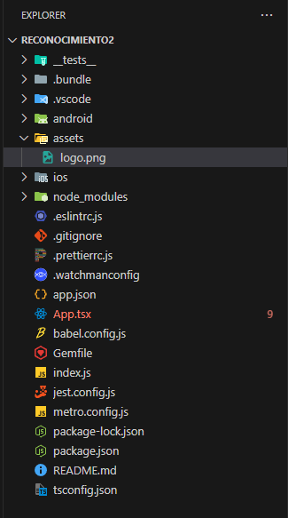{width="3.379166666666667in"
height="6.06875in"}

**Paso 8: Ejecutar la App en el Emulador o en un Dispositivo Físico**

Conectar un dispositivo Android físico y habilitar la Depuración USB en
las Opciones de Desarrollador.

Puede listar si el dispoitivo está conectado adb devices

listar los emuladores emulator -list-avds

cd android gradlew clean cd ..

Ejecutar el Proyecto en un Dispositivo Físico:

npx react-native run-android

Emulador de Android: Si prefieres usar un emulador, puedes instalar
Genymotion como alternativa al emulador de Android Studio:

Descargar Genymotion. Configura el emulador con una imagen de Android y
asegúrate de que adb detecte el emulador:

adb devices

**3. Despliegue Final**

**3.1 Revisar Configuración de Seguridad en AWS**

Asegúrate de que el grupo de seguridad en AWS permita el tráfico en el
puerto 8080 y que tu servidor sea accesible desde fuera de la red
privada.

**3.2 Generar la App para Producción**

Si todo funciona correctamente, puedes generar la versión de producción
de la app:

npx react-native run-android

Como Adición, para utilizer la app sin la necesidad de que el celular
este concetado por medio de usb, realiza esto:

npx react-native bundle \--platform android \--dev false \--entry-file
index.js \--bundle-output
android/app/src/main/assets/index.android.bundle \--assets-dest
android/app/src/main/res

cd android

./gradlew assembleReleas

Busca la ruta:

Y enviar este archive por cualquier medio, para que luego ser descargado
en el celular.
